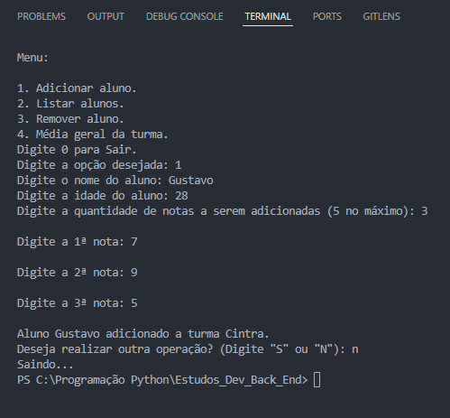

# 📚 Sistema de Cadastro de Alunos com Classes

Aplicação em Python para cadastro de alunos em turmas, com funcionalidades para adicionar, listar, remover e calcular média geral, via terminal.

---

## 📘 Descrição

Este projeto permite:

- Criar uma turma com nome e capacidade
- Adicionar alunos com nome, idade e notas
- Listar todos os alunos cadastrados
- Remover alunos por nome
- Calcular a média geral da turma
- Interação via terminal com entradas validadas

---

## 🧰 Tecnologias utilizadas

- Python 3
- Programação Orientada a Objetos (POO)
- Terminal interativo
- Git e GitHub

---

## 🚀 Como executar

1. Clone o repositório:

```bash
git clone https://github.com/GustavoCintra97/Estudos_Dev_Back_End.git
```

2. Acesse a pasta do projeto:

```bash
cd Estudos_Dev_Back_End/Projetos/Projeto\ 1\ -\ Sistema\ de\ Cadastro\ de\ Alunos\ com\ Classes
```

3. Execute o script principal:

```bash
python main.py
```

> Certifique-se de que os arquivos `aluno.py`, `turma.py` e `functions.py` estão na mesma pasta do `main.py`

---

## 🖼️ Exemplo de uso

```text
Digite o nome da turma: Engenharia
Digite a capacidade da turma: 3

Menu:
1. Adicionar aluno
2. Listar alunos
3. Remover aluno
4. Média geral da turma
0. Sair
```



---

## 📁 Estrutura do projeto

```
.
├── aluno.py         # Classe Aluno
├── turma.py         # Classe Turma
├── functions.py     # Funções auxiliares e menus
├── main.py          # Arquivo principal do sistema
├── README.md        # Este arquivo
└── print_terminal.png  # Imagem de exemplo da execução
```

---

## ✍️ Autor

- Gustavo Cintra  
- [github.com/GustavoCintra97](https://github.com/GustavoCintra97)

---

> Projeto desenvolvido como parte da evolução para Desenvolvedor Back-End Júnior