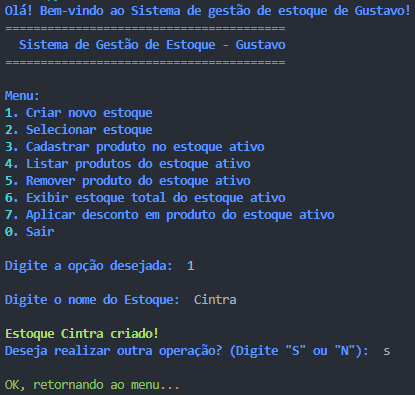

# 🧰 Gestor de Estoque com Descontos

Projeto em Python para gerenciamento de múltiplos estoques, com funcionalidades para cadastrar produtos, listar, remover, aplicar descontos (com validação) e controle total de itens.

---

## 📋 Sumário

1. [Sobre](#sobre)  
2. [Funcionalidades](#funcionalidades)  
3. [Tecnologias](#tecnologias)  
4. [Instalação](#instalação)  
5. [Uso](#uso)  
6. [Estrutura](#estrutura)  
7. [Evolução](#evolução)  
8. [Próximos passos](#próximos-passos)

---

## Sobre

Este projeto é um sistema de linha de comando (CLI) que permite gerenciar múltiplos estoques, cadastrar produtos, aplicar descontos e manter o total de itens atualizado. O foco está na organização, validação de entradas, tratamento de erros e interface interativa com `rich`.

---

## Funcionalidades

- Criar múltiplos estoques.
- Selecionar qual estoque está ativo para operações.
- Cadastrar produtos (nome, preço, quantidade) com validação de entradas e unicidade de nomes.
- Listar produtos com contagem.
- Remover produtos, com escolha por índice se houver mais de um produto com mesmo nome.
- Exibir quantidade total de itens no estoque.
- Aplicar descontos percentuais, garantindo que o preço não fique negativo.
- Interface colorida e limpa com `rich`, mensagens de erro claras e tratamento de exceções.

---

## Tecnologias

- **Python 3.10+**
- [rich](https://pypi.org/project/rich/) – Interface de terminal enriquecida
- Módulos padrão: `dataclasses`, `typing`, `re`, `os`, `traceback`

---

## Instalação

1. Clone o repositório:
   ```bash
   git clone https://github.com/GustavoCintra97/Estudos_Dev_Back_End.git
   cd Estudos_Dev_Back_End/Projetos/Projeto\ 2\ -\ Gestor\ de\ Estoque\ com\ Descontos
   ```
2. Crie um ambiente virtual e instale dependências:
   ```bash
   python -m venv venv
   source venv/bin/activate  # ou .\venv\Scripts\activate no Windows
   pip install rich
   ```

---

## Uso

Execute o script principal:
```bash
python main.py
```

Siga o menu:

1. Criar novo estoque  
2. Selecionar estoque  
3. Cadastrar produto  
4. Listar produtos  
5. Remover produto  
6. Exibir total itens  
7. Aplicar desconto  
0. Sair



---

## Estrutura do Projeto

- `main.py` – Loop principal e integração com `utils`.  
- `utils.py` – Funções modulares: entrada de dados, menu, lógica de produto/estoque, aplicação de descontos, telas.  
- `produto.py`, `estoque.py`, `gestao.py` – Classes com `dataclass` para abstração de entidades.  
- `README.md` – Documentação do projeto.

---

## Evolução

- 🔹 Começou com input/print simples.  
- 🔹 Refatoração para múltiplos estoques (`Gestao`), descontos parametrizados e validações.  
- 🔹 Adição da biblioteca `rich` para interface colorida e interação melhorada.  
- 🔹 Criação do `inputComParse(...)` e uso de regex para entradas robustas (descontos, floats, ints).


## Próximos Passos

- Persistência com leitura/gravação em arquivo JSON ou banco SQLite.
- Implementação de testes unitários com `pytest`.
- Evolução para uma API simples usando `Flask` ou `FastAPI`.
- Suporte a operações adicionais: editar produto, filtragem, relatórios.